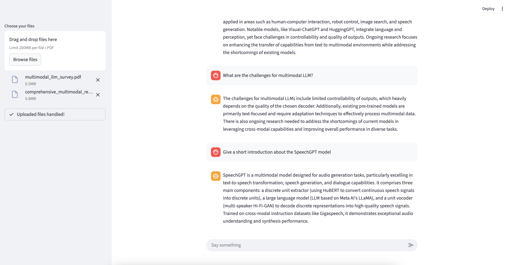

# Goal 
In this article, we will build a standard RAG pipeline to chat with your local PDF files. We will be using LangChain with OpenAI models, ChromaDB, unstructured, and Streamlit. At the end of this article, we will have a small app where users can upload PDFs and ask questions about their content.

At the high level, we will cover two main use cases:
  - handle uploaded files
  - answer user queries

The full code is available on GitHub [here](https://github.com/MiguelSteph/rag-chat-with-pdf).

# Flow to handle PDF files
The main steps to handle the PDF files are highlighted in the diagram below:


We start by using [unstructured]() to extract and chunk the text, tables, and images from the PDF files. I used the [`by_title`](https://docs.unstructured.io/api-reference/legacy-api/partition/chunking#”by-title”-chunking-strategy) chunking strategy in order to preserve the section boundaries. And to avoid having too many granular text chunks, I set `chunk_combine_text_under_n_chars` to `2_000`, so small text chunks will be combined.

```python
  elements = partition_pdf(file=file,
                          strategy="hi_res",
                          languages=["eng"],
                          infer_table_structure=True,
                          extract_images_in_pdf=True,
                          extract_image_block_types=["Image"],
                          extract_image_block_to_payload=True,
                          chunking_strategy="by_title",
                          chunk_combine_text_under_n_chars=2_000,
                          chunk_max_characters=10_000,
                          chunk_new_after_n_chars=8_000)
```

unstructured returns three types of elements: texts, tables, and images. The texts and tables are directly passed to the embedding model to generate the embedding vector. For images, I first use the `gpt-4o-mini` model to summarize the image and then create an embedding of the summary. I used the snippet below to generate the image summary:

```python
def get_img_summary(llm: ChatOpenAI, base64_image: str, mime_type: str) -> str:
  message = HumanMessage(content=[
      {
          "type": "text",
          "text": "Provide a concise summary of the provided image. Ensure the summary covers all key points and main ideas, without including external information."
       },
      {
          "type": "image_url",
          "image_url": {"url": f"data:image/jpeg;base64,{base64_image}"},
      },
  ])
  llm_response = llm.invoke([message])
  return llm_response.content
```

The final step is to save the embeddings along with their corresponding elements into the ChromaDb collection.

# Flow to handle user queries
The flow to handle the user queries is highlighted in the diagram below:


The user query first passes through the retriever, which provides additional context about the query. For that, the retriever queries the chromaDb collection for the top 5 documents most similar to the query. Next, I filter out any documents with a similarity score greater than `1.0`. That provides the relevant documents, which together serve as context to build the final prompt passed to the LLM. As this is a simple use case, I passed the full chat history to the LLM each time.

# Put everything together
I put everything together with a simple Streamlit app.



The result is quite impressive and very satisfying. 
For the next step, there are a few areas that can be improved:

- For a large pdf, `unstructured` takes a lot of time. An improvement could be to use the unstructured API instead of having it locally.
- When there are many text chunks, we easily hit the number of requests per minute.
- The UI can be updated to cite the added context documents


The full code is available on GitHub [here](https://github.com/MiguelSteph/rag-chat-with-pdf).

# References
- [unstructured - partition_pdf](https://docs.unstructured.io/open-source/core-functionality/partitioning#partition_pdf)
- [chroma](https://docs.trychroma.com/docs/collections/manage-collections)
- [Develop Web Apps with Streamlit](https://www.educative.io/courses/develop-web-apps-streamlit/streamlit-cloud)
- [Fundamentals of Retrieval-Augmented Generation with LangChain](https://www.educative.io/courses/rag-llm/understanding-retrieval-and-generative-models)
- [Multimodal RAG: Chat with PDFs (Images & Tables)](https://youtu.be/uLrReyH5cu0)